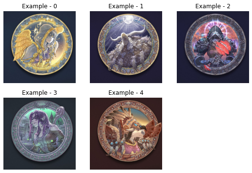
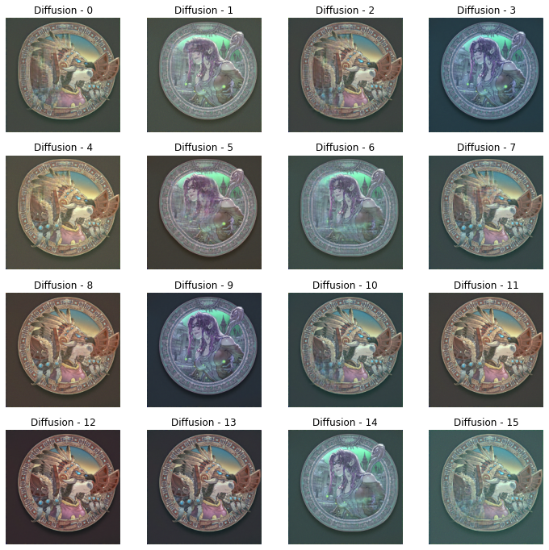
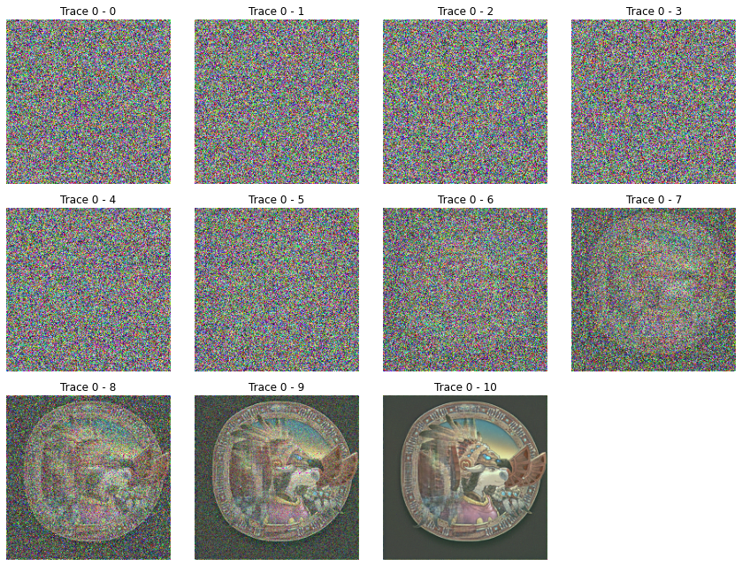

# Diffusion Model

Read the doc of [Doc](https://www.assemblyai.com/blog/diffusion-models-for-machine-learning-introduction/ "Doc").

---

-   [Diffusion Model](#diffusion-model)
    -   [Examples](#examples)
    -   [Notion](#notion)
        -   [Installation](#installation)

## Examples

The online script is cloned into the [example](./example/ "example").
The scripts are self-explained, (I hope so).

## Experiment-1

The experiment-1 is operated as learning the image distribution.
The script is in [script1.py](./experiment/script1.py).

The target images are



The learned images are



The diffusion process are



The model is saved in the file of [latest-model-200](./experiment/latest-model-200).
The **200** refers to the image size is $200 \times 200$.

## Notion

### Installation

```shell
$ pip install denoising_diffusion_pytorch
```

The pip installation messes my python env.
It installs torch==1.7.? automatically in my machine,
but it requires torch>=1.13.0 to operate.
So, I install the package first, and then install the pytorch==1.13.0 to correct the issue.
